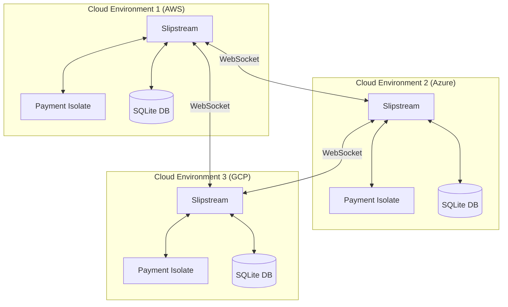
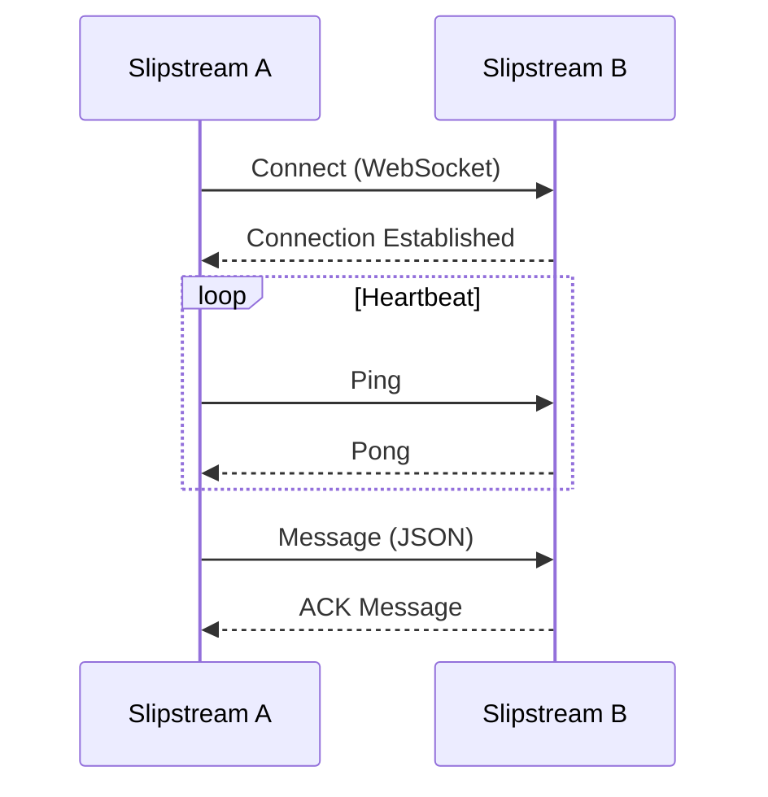
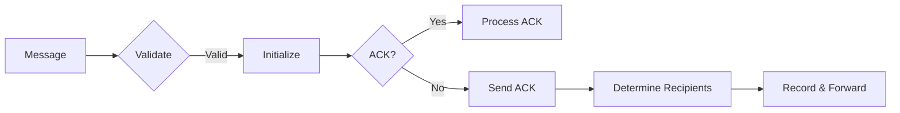
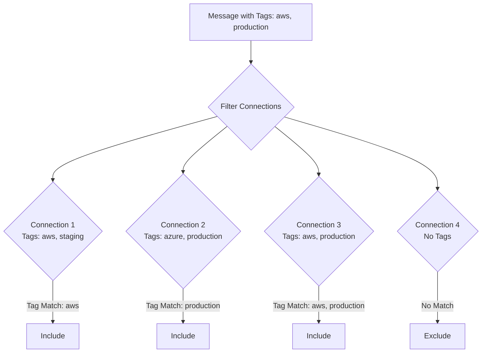
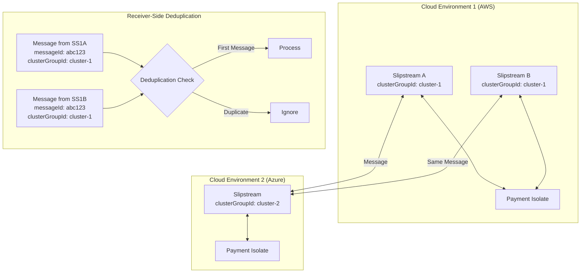

# System Patterns: Slipstream

## Architecture Overview

Slipstream follows a distributed architecture pattern where multiple instances communicate with each other across different cloud environments. Each instance maintains WebSocket connections to other instances, forming a mesh network that enables real-time data synchronization.



## Core Components

### Connection Manager

- **Pattern**: Connection Pool Manager
- **Responsibility**: Establishes and maintains WebSocket connections
- **Implementation**: Uses the WebSocket protocol for real-time communication
- **Key Features**:
    - Connection establishment and monitoring
    - Automatic reconnection with configurable retry attempts
    - Heartbeat mechanism to detect connection issues

### Message Router

- **Pattern**: Publish-Subscribe with Path Tracking
- **Responsibility**: Routes messages to appropriate destinations
- **Implementation**: Uses message path tracking to prevent loops
- **Key Features**:
    - Path-based routing to prevent message loops
    - Tag-based routing for targeted message delivery
    - Message acknowledgment for delivery confirmation

### Persistence Layer

- **Pattern**: Message Store
- **Responsibility**: Stores messages and tracks delivery status
- **Implementation**: Uses SQLite database for message persistence
- **Key Features**:
    - Message storage and retrieval
    - Delivery status tracking
    - Support for message republishing

### Metrics Server

- **Pattern**: Monitoring Endpoint
- **Responsibility**: Exposes metrics for system monitoring
- **Implementation**: Prometheus-compatible metrics endpoint
- **Key Features**:
    - System metrics (CPU, memory)
    - Connection metrics
    - Message processing metrics

## Communication Patterns

### WebSocket Communication



### Message Routing



### Message Types

1. **SK (Set Key)**

    - **Pattern**: Key-Value Synchronization
    - **Purpose**: Set a key-value pair in Redis across all instances
    - **Structure**:
        ```json
        {
            "type": "SK",
            "key": "order:123",
            "value": "{...order data...}",
            "messageId": "msg-abc123",
            "originInstanceId": "con-12345",
            "sourceInstanceId": "con-12345",
            "messagePath": ["con-12345"],
            "targetedTags": ["aws", "production"]
        }
        ```

2. **SA (Set Array)**

    - **Pattern**: Array Synchronization
    - **Purpose**: Set an array value for a key across all instances
    - **Structure**:
        ```json
        {
            "type": "SA",
            "key": "pending-orders",
            "value": ["order:123", "order:456"],
            "messageId": "msg-def456",
            "originInstanceId": "con-12345",
            "sourceInstanceId": "con-12345",
            "messagePath": ["con-12345"]
        }
        ```

3. **ACK (Acknowledgment)**

    - **Pattern**: Message Acknowledgment
    - **Purpose**: Confirm receipt of a message
    - **Structure**:
        ```json
        {
            "type": "ACK",
            "messageId": "msg-abc123",
            "originInstanceId": "con-67890",
            "sourceInstanceId": "con-67890",
            "messagePath": ["con-67890"]
        }
        ```

4. **Future Message Types**
    - **GA (Get Array)**: Request array data from other instances
    - **GK (Get Key)**: Request key-value data from other instances
    - **GW (Get Weighted)**: Request weighted data from other instances
    - **SW (Set Weighted)**: Set weighted data across instances
    - **CMD (Command)**: Execute commands on other instances

## Tag-Based Routing



## Error Handling Patterns

### Connection Error Handling

- **Pattern**: Circuit Breaker
- **Implementation**: Limits reconnection attempts to prevent resource exhaustion
- **Approach**: Exponential backoff for reconnection attempts

### Message Processing Error Handling

- **Pattern**: Dead Letter Queue
- **Implementation**: Failed messages are tracked separately
- **Approach**: Messages that exceed retry count are marked as failed

## Persistence Patterns

### Message Storage

- **Pattern**: Event Store
- **Implementation**: SQLite database with message tables
- **Approach**: Messages are stored with metadata for tracking

### Message Republishing

- **Pattern**: Retry with Backoff
- **Implementation**: Controlled republishing of unacknowledged messages
- **Approach**: Messages are republished with a delay between attempts

## Monitoring Patterns

### Metrics Collection

- **Pattern**: Push-based Metrics
- **Implementation**: Prometheus-compatible metrics endpoint
- **Key Metrics**:
    - Active connections
    - Message processing rate
    - Error counts
    - System resource usage

### Logging

- **Pattern**: Structured Logging
- **Implementation**: JSON-formatted logs with context
- **Log Levels**:
    - message: WebSocket message-related logs
    - debug: Debug-level logs
    - error: Error logs
    - critical: Critical error logs

## Message Deduplication Pattern

### Cluster-Based Deduplication

- **Pattern**: Receiver-Side Deduplication with Cluster Identification
- **Purpose**: Prevent duplicate message processing when multiple Slipstream instances are deployed between servers
- **Implementation**:
    - Messages include a `clusterGroupId` to identify their cluster group
    - Receiving servers deduplicate messages based on `messageId` and `clusterGroupId`
    - Messages without a `clusterGroupId` are treated as belonging to a default "singleton" cluster



### Message Structure with Cluster Identification

- **Pattern**: Message Metadata Extension
- **Implementation**: Extend the `TMessage` type with an optional `clusterGroupId` field
- **Example**:
    ```json
    {
        "type": "SK",
        "key": "order:123",
        "value": "{...order data...}",
        "messageId": "msg-abc123",
        "originInstanceId": "con-12345",
        "sourceInstanceId": "con-12345",
        "messagePath": ["con-12345"],
        "targetedTags": ["aws", "production"],
        "clusterGroupId": "cluster-1"
    }
    ```

### Deduplication Store

- **Pattern**: Time-Limited Cache
- **Implementation**: Store processed message IDs with their cluster group IDs
- **Key Features**:
    - Composite key using `messageId` and `clusterGroupId`
    - Time-based expiration to prevent unbounded growth
    - Support for different storage backends (in-memory, Redis, etc.)

## Configuration Patterns

### Environment-Based Configuration

- **Pattern**: Environment Variables
- **Implementation**: Configuration via environment variables
- **Key Settings**:
    - URL_CONFIG: Connection configuration (includes `clusterGroupId`)
    - SLIPSTREAM_STORAGE_PATH: Database location
    - SLIPSTREAM_RETRY_IN_N_SECONDS: Retry interval
    - SLIPSTREAM_CONNECTION_RETRY_ATTEMPTS: Max retry attempts

### Dynamic Configuration

- **Pattern**: Runtime Configuration
- **Implementation**: Logging configuration can be changed at runtime
- **Approach**: HTTP endpoint for configuration changes
